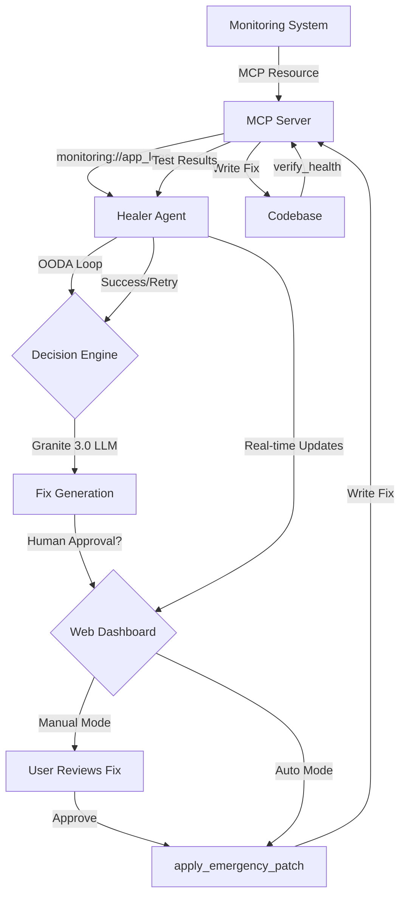

# Context-Aware Healing System - Implementation Plan

## Executive Summary

This document outlines the implementation plan for a production-ready, agentic self-healing framework that uses the Model Context Protocol (MCP) to bridge monitoring data into an autonomous reasoning loop. The system implements an OODA-based (Observe, Orient, Decide, Act) architecture.

## Architecture Overview



## System Components

### 1. MCP Server (`/mcp_server`)

**Purpose**: Expose monitoring data and remediation tools via MCP protocol

**Key Files**:
- [`server.py`](mcp_server/server.py) - Main MCP server implementation
- [`resources.py`](mcp_server/resources.py) - Resource handlers (monitoring://app_logs)
- [`tools.py`](mcp_server/tools.py) - Tool implementations (apply_emergency_patch, verify_health)
- [`config.py`](mcp_server/config.py) - Server configuration
- [`__init__.py`](mcp_server/__init__.py) - Package initialization

**MCP Resources**:
- `monitoring://app_logs` - Fetches latest system errors from log files
  - Returns: JSON with error messages, timestamps, stack traces
  - Configurable log path and error severity levels

**MCP Tools**:
- `apply_emergency_patch(file_path: str, patch_content: str)` - Writes fixes to codebase
  - Validates file paths for security
  - Creates backups before applying patches
  - Returns: Success status and backup location
  
- `verify_health(test_command: str)` - Runs test suites
  - Executes test commands in isolated environment
  - Captures stdout/stderr
  - Returns: Test results, exit code, coverage metrics

### 2. Healer Agent (`/healer_agent.py`)

**Purpose**: Autonomous agent implementing OODA loop for self-healing

**OODA Loop Implementation**:

1. **Observe** - Monitor system state via MCP resources
   - Poll `monitoring://app_logs` for errors
   - Detect anomalies and crashes
   - Collect context (stack traces, error patterns)
   - Broadcast observations to Web Dashboard

2. **Orient** - Analyze and contextualize the problem
   - Parse error messages and stack traces
   - Identify affected components
   - Retrieve relevant code context
   - Build problem statement for LLM
   - Update dashboard with analysis progress

3. **Decide** - Generate fix using Granite 3.0
   - Construct prompt with error context
   - Call Granite 3.0 API for fix generation
   - Validate generated fix syntax
   - Assess risk level of proposed changes
   - **Human-in-the-Loop**: Present fix to user via dashboard

4. **Approve** - Human approval gate (Manual Mode only)
   - Display proposed fix in Web Dashboard
   - Show diff, risk assessment, and reasoning
   - Wait for user to click "Confirm Patch" or "Reject"
   - In Auto Mode, skip this step and proceed directly

5. **Act** - Apply and verify the fix
   - Use `apply_emergency_patch` tool
   - Execute `verify_health` to confirm fix
   - Log results and update monitoring
   - Update dashboard with results
   - Retry with different approach if failed

**Key Classes**:
- `HealerAgent` - Main orchestrator
- `OODALoop` - OODA cycle implementation
- `ErrorDetector` - Observes and parses errors
- `FixGenerator` - Interfaces with Granite 3.0
- `PatchApplier` - Applies and validates fixes

### 3. Example Application (`/examples`)

**Purpose**: Demonstrate self-healing capabilities

**Files**:
- [`broken_app.py`](examples/broken_app.py) - Intentionally buggy application
- [`test_broken_app.py`](examples/test_broken_app.py) - Test suite for validation
- [`logs/`](examples/logs/) - Directory for application logs

**Broken App Features**:
- Division by zero error
- Null pointer exceptions
- Type mismatches
- Resource leaks

### 4. Web Dashboard (`/ui`)

**Purpose**: Real-time visualization and human-in-the-loop approval interface

**Key Files**:
- [`main.py`](ui/main.py) - FastAPI application server
- [`static/index.html`](ui/static/index.html) - Dashboard UI with Tailwind CSS
- [`static/app.js`](ui/static/app.js) - Frontend JavaScript for real-time updates
- [`websocket.py`](ui/websocket.py) - WebSocket handler for live updates
- [`models.py`](ui/models.py) - Pydantic models for API

**Dashboard Features**:

1. **Real-Time OODA Loop Visualization**
   - Live status of current phase (Observe, Orient, Decide, Approve, Act)
   - Progress indicators for each phase
   - Timeline of recent healing attempts
   - Success/failure statistics

2. **Error Log Display**
   - List of detected errors with timestamps
   - Stack traces and error context
   - Severity indicators (ERROR, CRITICAL)
   - Filter and search capabilities

3. **Fix Review Interface** (Manual Mode)
   - Side-by-side diff view (before/after)
   - Syntax-highlighted code display
   - Risk assessment display
   - LLM reasoning explanation
   - "Confirm Patch" and "Reject" buttons
   - Comment field for rejection reasons

4. **Approval Queue**
   - List of pending fixes awaiting approval
   - Priority sorting by severity
   - Batch approval capabilities
   - Approval history log

5. **System Metrics**
   - Total errors detected
   - Fixes applied (auto/manual)
   - Success rate percentage
   - Average healing time
   - System health status

6. **Mode Toggle**
   - Switch between Manual and Auto mode
   - Visual indicator of current mode
   - Confirmation dialog for mode changes

**API Endpoints**:
- `GET /` - Dashboard UI
- `GET /api/status` - Current system status
- `GET /api/errors` - List of detected errors
- `GET /api/pending-fixes` - Fixes awaiting approval
- `POST /api/approve/{fix_id}` - Approve a fix
- `POST /api/reject/{fix_id}` - Reject a fix
- `POST /api/mode` - Toggle manual/auto mode
- `WS /ws` - WebSocket for real-time updates

**Technology Stack**:
- **Backend**: FastAPI (async Python web framework)
- **Frontend**: HTML5 + Tailwind CSS (via CDN)
- **Real-time**: WebSocket for live updates
- **State Management**: In-memory queue for pending approvals

## Project Structure

```
context-aware-healing-system/
├── README.md
├── IMPLEMENTATION_PLAN.md
├── pyproject.toml                 # Project dependencies and metadata
├── requirements.txt               # Pip dependencies
├── .env.example                   # Environment variables template
├── .gitignore                     # Git ignore patterns
│
├── mcp_server/                    # MCP Server Component
│   ├── __init__.py
│   ├── server.py                  # Main MCP server
│   ├── resources.py               # Resource handlers
│   ├── tools.py                   # Tool implementations
│   ├── config.py                  # Configuration management
│   └── utils.py                   # Utility functions
│
├── ui/                            # Web Dashboard
│   ├── __init__.py
│   ├── main.py                    # FastAPI application
│   ├── websocket.py               # WebSocket handler
│   ├── models.py                  # Pydantic models
│   └── static/                    # Frontend assets
│       ├── index.html             # Dashboard UI
│       └── app.js                 # Frontend JavaScript
│
├── healer_agent.py                # Main healing agent
├── ooda_loop.py                   # OODA loop implementation
├── error_detector.py              # Error detection logic
├── fix_generator.py               # LLM-based fix generation
├── patch_applier.py               # Patch application logic
│
├── config/                        # Configuration files
│   ├── agent_config.yaml          # Agent configuration
│   └── mcp_config.yaml            # MCP server configuration
│
├── examples/                      # Example applications
│   ├── broken_app.py              # Intentionally broken app
│   ├── test_broken_app.py         # Test suite
│   └── logs/                      # Application logs
│       └── app.log
│
├── tests/                         # Test suite
│   ├── __init__.py
│   ├── test_mcp_server.py
│   ├── test_healer_agent.py
│   └── test_ooda_loop.py
│
├── logs/                          # System logs
│   └── healer.log
│
└── backups/                       # Backup directory for patches
    └── .gitkeep
```

## Technology Stack

### Core Dependencies

1. **MCP SDK** (`mcp>=0.9.0`)
   - Model Context Protocol implementation
   - Server and client capabilities

2. **HTTP Client** (`httpx>=0.27.0`)
   - Async HTTP requests
   - Granite 3.0 API communication

3. **Data Validation** (`pydantic>=2.0.0`)
   - Schema validation
   - Configuration management

4. **LLM Integration** (`openai>=1.0.0` or `ibm-watsonx-ai`)
   - Granite 3.0 API client
   - Prompt engineering utilities

5. **Testing** (`pytest>=8.0.0`, `pytest-asyncio>=0.23.0`)
   - Unit and integration tests
   - Async test support

6. **Logging** (`structlog>=24.0.0`)
   - Structured logging
   - JSON log formatting

7. **Configuration** (`pyyaml>=6.0`, `python-dotenv>=1.0.0`)
   - YAML config parsing
   - Environment variable management

8. **Web Framework** (`fastapi>=0.110.0`, `uvicorn>=0.27.0`)
   - FastAPI for REST API and WebSocket
   - Uvicorn ASGI server
   - Real-time dashboard backend

9. **WebSocket** (`websockets>=12.0`)
   - Real-time communication
   - Live OODA loop updates
   - Bidirectional messaging

### Development Dependencies

- `black` - Code formatting
- `ruff` - Linting
- `mypy` - Type checking
- `pre-commit` - Git hooks

## Implementation Phases

### Phase 1: Foundation Setup
- Initialize Python project structure
- Configure dependencies in [`pyproject.toml`](pyproject.toml)
- Set up logging and configuration management
- Create base directory structure

### Phase 2: MCP Server Implementation
- Implement MCP server boilerplate
- Create `monitoring://app_logs` resource
- Implement `apply_emergency_patch` tool
- Implement `verify_health` tool
- Add error handling and validation

### Phase 3: OODA Loop Core
- Implement OODA loop architecture
- Create error detection module
- Build fix generation with Granite 3.0
- Implement patch application logic
- Add retry and fallback mechanisms

### Phase 4: Web Dashboard
- Create FastAPI application structure
- Implement REST API endpoints
- Build WebSocket handler for real-time updates
- Create HTML/CSS dashboard with Tailwind
- Implement JavaScript for live OODA visualization
- Add human-in-the-loop approval interface
- Implement manual/auto mode toggle

### Phase 5: Healer Agent Integration
- Integrate OODA loop with MCP client
- Connect healer agent to Web Dashboard
- Implement autonomous decision-making
- Add human approval gate for manual mode
- Add safety checks and validation
- Create monitoring and alerting
- Implement approval queue management

### Phase 7: Testing & Examples
- Create broken example application
- Write comprehensive test suite for all components
- Add integration tests for dashboard
- Test manual approval workflow
- Create documentation and usage examples

### Phase 8: Production Hardening
- Add rate limiting and throttling
- Implement circuit breakers
- Add metrics and observability
- Security hardening
- Performance optimization

## Configuration Management

### Environment Variables (`.env`)

```bash
# Granite 3.0 API Configuration
GRANITE_API_KEY=your_api_key_here
GRANITE_API_URL=https://api.granite.example.com/v1
GRANITE_MODEL=granite-3.0-8b-instruct

# MCP Server Configuration
MCP_SERVER_HOST=localhost
MCP_SERVER_PORT=8080
MCP_LOG_LEVEL=INFO

# Healer Agent Configuration
HEALER_POLL_INTERVAL=30
HEALER_MAX_RETRIES=3
HEALER_BACKUP_DIR=./backups

# Monitoring Configuration
LOG_FILE_PATH=./examples/logs/app.log
ERROR_SEVERITY_THRESHOLD=ERROR
```

### Agent Configuration (`config/agent_config.yaml`)

```yaml
ooda_loop:
  observe:
    poll_interval_seconds: 30
    error_threshold: 1
    
  orient:
    context_window_lines: 50
    max_stack_trace_depth: 10
    
  decide:
    model: granite-3.0-8b-instruct
    temperature: 0.2
    max_tokens: 2000
    
  act:
    backup_enabled: true
    dry_run: false
    verification_timeout: 60

safety:
  allowed_file_patterns:
    - "*.py"
    - "*.js"
    - "*.ts"
  forbidden_paths:
    - "/etc"
    - "/sys"
    - "/proc"
  max_patch_size_bytes: 10240
```

## Security Considerations

1. **File System Access**
   - Whitelist allowed file patterns
   - Validate all file paths
   - Prevent directory traversal attacks

2. **Code Execution**
   - Sandbox test execution
   - Timeout mechanisms
   - Resource limits (CPU, memory)

3. **API Security**
   - Secure API key storage
   - Rate limiting
   - Request validation

4. **Backup Strategy**
   - Automatic backups before patches
   - Rollback capabilities
   - Backup retention policy

## Monitoring & Observability

1. **Metrics**
   - Error detection rate
   - Fix success rate
   - Average healing time
   - System health score

2. **Logging**
   - Structured JSON logs
   - Log levels (DEBUG, INFO, WARNING, ERROR)
   - Correlation IDs for tracing

3. **Alerting**
   - Failed healing attempts
   - Critical errors
   - System degradation

## Testing Strategy

1. **Unit Tests**
   - Individual component testing
   - Mock external dependencies
   - Edge case coverage

2. **Integration Tests**
   - MCP server communication
   - End-to-end OODA loop
   - LLM integration

3. **System Tests**
   - Full healing scenarios
   - Performance benchmarks
   - Failure recovery

## Success Criteria

1. ✅ MCP server successfully exposes resources and tools
2. ✅ Healer agent detects errors from logs
3. ✅ Granite 3.0 generates valid fixes
4. ✅ Patches are applied safely with backups
5. ✅ Health verification confirms fixes work
6. ✅ System handles failures gracefully
7. ✅ Example broken app is successfully healed
8. ✅ Comprehensive test coverage (>80%)
9. ✅ Production-ready error handling
10. ✅ Complete documentation

## Next Steps

1. Review and approve this implementation plan
2. Switch to Code mode to begin implementation
3. Start with Phase 1: Foundation Setup
4. Iteratively implement each phase
5. Test and validate each component
6. Deploy and monitor in production

## References

- [Model Context Protocol Specification](https://modelcontextprotocol.io/)
- [Granite 3.0 Documentation](https://www.ibm.com/granite)
- [OODA Loop Methodology](https://en.wikipedia.org/wiki/OODA_loop)
- Python MCP SDK: `pip install mcp`