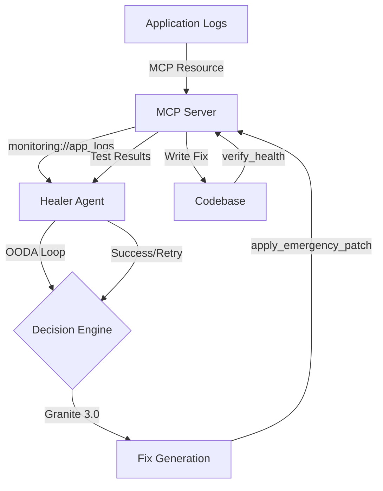

# Context-Aware Healing System

A production-ready, agentic self-healing framework that uses the Model Context Protocol (MCP) to bridge monitoring data into an autonomous reasoning loop. The system implements an OODA-based (Observe, Orient, Decide, Act) architecture to detect, analyze, and automatically fix code errors using Granite 3.0.

## 🎯 Overview

This framework enables autonomous code repair by:
- **Observing** system errors through MCP-exposed monitoring resources
- **Orienting** by analyzing error context and retrieving relevant code
- **Deciding** on fixes using Granite 3.0 LLM reasoning
- **Acting** by applying patches and verifying health

## 🏗️ Architecture



## 📋 Features

- ✅ **MCP-Based Monitoring**: Expose logs and metrics via Model Context Protocol
- ✅ **OODA Loop**: Systematic observe-orient-decide-act cycle
- ✅ **LLM-Powered Fixes**: Granite 3.0 generates contextual code repairs
- ✅ **Safety First**: Automatic backups, syntax validation, and rollback
- ✅ **Health Verification**: Automated test execution after patches
- ✅ **Production Ready**: Comprehensive logging, metrics, and error handling
- ✅ **Extensible**: Modular architecture for custom resources and tools

## 🚀 Quick Start

### Prerequisites

- Python 3.11 or higher
- Granite 3.0 API access (or compatible OpenAI API endpoint)
- Git

### Installation

1. **Clone the repository**
```bash
git clone https://github.com/gredss/context-aware-healing-system.git
cd context-aware-healing-system
```

2. **Install dependencies**
```bash
# Using pip
pip install -r requirements.txt

# Or using Poetry (recommended)
poetry install
```

3. **Configure environment**
```bash
cp .env.example .env
# Edit .env with your Granite API credentials
```

4. **Start the MCP server**
```bash
python -m mcp_server.server
```

5. **Run the healer agent**
```bash
python healer_agent.py
```

### Testing with Example App

```bash
# Run the intentionally broken application
python examples/broken_app.py

# The healer agent will detect errors and attempt fixes automatically
# Check logs/healer.log for healing attempts
```

## 📁 Project Structure

```
context-aware-healing-system/
├── README.md                      # This file
├── IMPLEMENTATION_PLAN.md         # Detailed implementation plan
├── TECHNICAL_SPEC.md              # Technical specifications
├── DEPENDENCIES.md                # Dependency documentation
├── pyproject.toml                 # Project metadata and dependencies
├── requirements.txt               # Pip dependencies
├── .env.example                   # Environment variables template
│
├── mcp_server/                    # MCP Server Component
│   ├── __init__.py
│   ├── server.py                  # Main MCP server
│   ├── resources.py               # Resource handlers
│   ├── tools.py                   # Tool implementations
│   ├── config.py                  # Configuration
│   └── utils.py                   # Utilities
│
├── healer_agent.py                # Main healing agent
├── ooda_loop.py                   # OODA loop implementation
├── error_detector.py              # Error detection
├── fix_generator.py               # LLM-based fix generation
├── patch_applier.py               # Patch application
│
├── config/                        # Configuration files
│   ├── agent_config.yaml          # Agent configuration
│   └── mcp_config.yaml            # MCP server configuration
│
├── examples/                      # Example applications
│   ├── broken_app.py              # Test application
│   ├── test_broken_app.py         # Test suite
│   └── logs/                      # Application logs
│
├── tests/                         # Test suite
│   ├── test_mcp_server.py
│   ├── test_healer_agent.py
│   └── test_ooda_loop.py
│
├── logs/                          # System logs
└── backups/                       # Backup directory
```

## 🔧 Configuration

### Environment Variables (`.env`)

```bash
# Granite 3.0 API Configuration
GRANITE_API_KEY=your_api_key_here
GRANITE_API_URL=https://api.granite.example.com/v1
GRANITE_MODEL=granite-3.0-8b-instruct

# MCP Server Configuration
MCP_SERVER_HOST=localhost
MCP_SERVER_PORT=8080
MCP_LOG_LEVEL=INFO

# Healer Agent Configuration
HEALER_POLL_INTERVAL=30
HEALER_MAX_RETRIES=3
HEALER_BACKUP_DIR=./backups

# Monitoring Configuration
LOG_FILE_PATH=./examples/logs/app.log
ERROR_SEVERITY_THRESHOLD=ERROR
```

### Agent Configuration (`config/agent_config.yaml`)

```yaml
ooda_loop:
  observe:
    poll_interval_seconds: 30
    error_threshold: 1
    
  orient:
    context_window_lines: 50
    max_stack_trace_depth: 10
    
  decide:
    model: granite-3.0-8b-instruct
    temperature: 0.2
    max_tokens: 2000
    
  act:
    backup_enabled: true
    dry_run: false
    verification_timeout: 60

safety:
  allowed_file_patterns:
    - "*.py"
    - "*.js"
    - "*.ts"
  forbidden_paths:
    - "/etc"
    - "/sys"
    - "/proc"
  max_patch_size_bytes: 10240
```

## 🔌 MCP Resources & Tools

### Resource: `monitoring://app_logs`

Fetches latest system errors from application logs.

**Response Format**:
```json
{
  "logs": [
    {
      "timestamp": "2026-04-08T04:00:00Z",
      "level": "ERROR",
      "message": "Division by zero in calculate_average",
      "stack_trace": "Traceback...",
      "file": "examples/broken_app.py",
      "line": 42
    }
  ],
  "total_errors": 5
}
```

### Tool: `apply_emergency_patch`

Applies code fixes with safety checks and backups.

**Parameters**:
- `file_path`: Relative path to file
- `patch_content`: New file content
- `backup`: Create backup (default: true)
- `validate_syntax`: Validate syntax (default: true)

### Tool: `verify_health`

Runs test suites to verify fixes.

**Parameters**:
- `test_command`: Command to run tests
- `timeout`: Timeout in seconds (default: 60)
- `working_dir`: Working directory (optional)

## 🧪 Testing

### Run Unit Tests
```bash
pytest tests/
```

### Run Integration Tests
```bash
pytest tests/ -m integration
```

### Run with Coverage
```bash
pytest tests/ --cov=. --cov-report=html
```

### Test the Healing System
```bash
# Start the broken app (generates errors)
python examples/broken_app.py &

# Start the healer agent
python healer_agent.py

# Monitor healing attempts
tail -f logs/healer.log
```

## 📊 Monitoring & Metrics

The system exposes Prometheus metrics:

- `healer_errors_detected_total` - Total errors detected
- `healer_fixes_applied_total` - Total fixes applied
- `healer_fixes_successful_total` - Successful fixes
- `healer_healing_duration_seconds` - Time to heal
- `healer_agent_health` - Agent health status

Access metrics at: `http://localhost:9090/metrics`

## 🔒 Security

### Safety Features

1. **Path Validation**: Prevents directory traversal attacks
2. **Backup System**: Automatic backups before any changes
3. **Syntax Validation**: Validates code before applying
4. **Sandboxed Execution**: Tests run in isolated environment
5. **Rate Limiting**: Prevents API abuse
6. **Audit Logging**: Complete audit trail of all actions

### Best Practices

- Store API keys in environment variables
- Use read-only file system where possible
- Enable dry-run mode for testing
- Review logs regularly
- Keep backups for compliance

## 📚 Documentation

- [Implementation Plan](IMPLEMENTATION_PLAN.md) - Detailed implementation roadmap
- [Technical Specification](TECHNICAL_SPEC.md) - Technical details and API specs
- [Dependencies](DEPENDENCIES.md) - Dependency documentation and rationale

## 🛠️ Development

### Setup Development Environment

```bash
# Install development dependencies
pip install -r requirements-dev.txt

# Install pre-commit hooks
pre-commit install

# Run linting
ruff check .

# Run type checking
mypy .

# Format code
black .
```

### Adding New MCP Resources

1. Define resource in [`mcp_server/resources.py`](mcp_server/resources.py)
2. Register in [`mcp_server/server.py`](mcp_server/server.py)
3. Add tests in [`tests/test_mcp_server.py`](tests/test_mcp_server.py)
4. Update documentation

### Adding New MCP Tools

1. Define tool in [`mcp_server/tools.py`](mcp_server/tools.py)
2. Register in [`mcp_server/server.py`](mcp_server/server.py)
3. Add tests in [`tests/test_mcp_server.py`](tests/test_mcp_server.py)
4. Update documentation

## 🚢 Deployment

### Docker

```bash
# Build image
docker build -t healer-agent .

# Run container
docker run -d \
  --name healer-agent \
  -e GRANITE_API_KEY=$GRANITE_API_KEY \
  -v $(pwd)/logs:/app/logs \
  -v $(pwd)/backups:/app/backups \
  healer-agent
```

### Kubernetes

```bash
# Apply deployment
kubectl apply -f k8s/deployment.yaml

# Check status
kubectl get pods -l app=healer-agent

# View logs
kubectl logs -f deployment/healer-agent
```

## 🤝 Contributing

Contributions are welcome! Please:

1. Fork the repository
2. Create a feature branch (`git checkout -b feature/amazing-feature`)
3. Commit your changes (`git commit -m 'Add amazing feature'`)
4. Push to the branch (`git push origin feature/amazing-feature`)
5. Open a Pull Request

## 📝 License

This project is licensed under the MIT License - see the LICENSE file for details.

## 🙏 Acknowledgments

- [Model Context Protocol](https://modelcontextprotocol.io/) - For the MCP specification
- [IBM Granite](https://www.ibm.com/granite) - For the Granite 3.0 LLM
- [OODA Loop](https://en.wikipedia.org/wiki/OODA_loop) - For the decision-making framework

## 📧 Contact

For questions or support, please open an issue on GitHub.

## 🗺️ Roadmap

- [ ] Multi-model LLM support (GPT-4, Claude, etc.)
- [ ] Web UI for monitoring and control
- [ ] Learning from historical fixes
- [ ] Distributed healing across multiple agents
- [ ] Predictive error detection
- [ ] Integration with popular monitoring tools (Datadog, New Relic)
- [ ] Support for more languages (JavaScript, Java, Go)

## ⚠️ Disclaimer

This is an autonomous code modification system. Always:
- Test in a safe environment first
- Review generated fixes before production use
- Maintain proper backups
- Monitor system behavior
- Have rollback procedures ready

**Use at your own risk. The authors are not responsible for any damage caused by this software.**

---

**Built with ❤️ by the Context-Aware Healing System Team**
