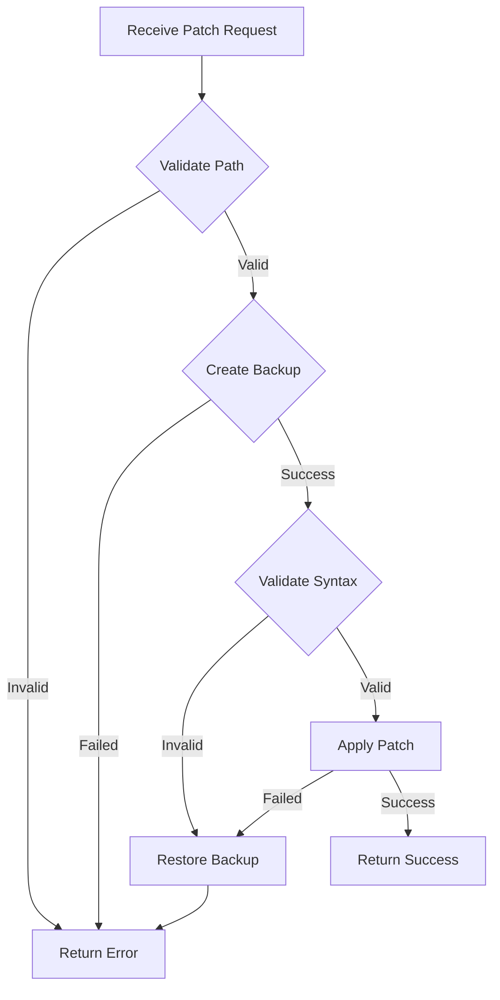

# Technical Specification

## 1. MCP Server Component

### 1.1 Server Architecture

The MCP server follows a modular architecture with clear separation of concerns:

```
mcp_server/
├── server.py       # Main server entry point
├── resources.py    # Resource handlers
├── tools.py        # Tool implementations
├── config.py       # Configuration management
└── utils.py        # Shared utilities
```

### 1.2 Resource: `monitoring://app_logs`

**Purpose**: Expose application logs as an MCP resource for error detection.

**URI Scheme**: `monitoring://app_logs`

**Response Schema**:
```json
{
  "logs": [
    {
      "timestamp": "2026-04-08T04:00:00Z",
      "level": "ERROR",
      "message": "Division by zero in calculate_average",
      "stack_trace": "Traceback (most recent call last)...",
      "file": "examples/broken_app.py",
      "line": 42,
      "function": "calculate_average"
    }
  ],
  "total_errors": 5,
  "time_range": {
    "start": "2026-04-08T03:00:00Z",
    "end": "2026-04-08T04:00:00Z"
  }
}
```

**Implementation Details**:
- Parse log files using regex patterns
- Support multiple log formats (JSON, plain text, syslog)
- Filter by severity level (ERROR, CRITICAL)
- Configurable time window (default: last 1 hour)
- Handle log rotation and multiple log files
- Cache parsed logs for performance

**Error Patterns to Detect**:
```python
ERROR_PATTERNS = {
    "exception": r"(Exception|Error):\s*(.+)",
    "traceback": r"Traceback \(most recent call last\):",
    "assertion": r"AssertionError:\s*(.+)",
    "syntax": r"SyntaxError:\s*(.+)",
    "type": r"TypeError:\s*(.+)",
    "value": r"ValueError:\s*(.+)",
    "zero_division": r"ZeroDivisionError:\s*(.+)",
}
```

### 1.3 Tool: `apply_emergency_patch`

**Purpose**: Apply code fixes to the codebase with safety checks.

**Input Schema**:
```python
class ApplyPatchInput(BaseModel):
    file_path: str = Field(..., description="Relative path to file")
    patch_content: str = Field(..., description="New file content")
    backup: bool = Field(default=True, description="Create backup")
    validate_syntax: bool = Field(default=True, description="Validate Python syntax")
```

**Output Schema**:
```python
class ApplyPatchOutput(BaseModel):
    success: bool
    message: str
    backup_path: Optional[str] = None
    validation_errors: List[str] = []
```

**Safety Checks**:
1. **Path Validation**
   - Must be within project directory
   - No directory traversal (`..`)
   - Match allowed file patterns (*.py, *.js, etc.)
   - Not in forbidden paths (/etc, /sys, /proc)

2. **Backup Creation**
   - Timestamp-based backup naming
   - Store in `backups/` directory
   - Keep last N backups (configurable)
   - Atomic file operations

3. **Syntax Validation**
   - Parse Python code with `ast.parse()`
   - Check for syntax errors
   - Validate imports exist
   - Optional: Run linter (ruff)

4. **Size Limits**
   - Max patch size: 10KB (configurable)
   - Prevent resource exhaustion

**Implementation Flow**:


### 1.4 Tool: `verify_health`

**Purpose**: Execute test suites to verify system health after patches.

**Input Schema**:
```python
class VerifyHealthInput(BaseModel):
    test_command: str = Field(..., description="Command to run tests")
    timeout: int = Field(default=60, description="Timeout in seconds")
    working_dir: Optional[str] = Field(default=None, description="Working directory")
    env_vars: Dict[str, str] = Field(default_factory=dict, description="Environment variables")
```

**Output Schema**:
```python
class VerifyHealthOutput(BaseModel):
    success: bool
    exit_code: int
    stdout: str
    stderr: str
    duration: float
    tests_run: Optional[int] = None
    tests_passed: Optional[int] = None
    tests_failed: Optional[int] = None
    coverage: Optional[float] = None
```

**Execution Environment**:
- Isolated subprocess execution
- Configurable timeout (default: 60s)
- Capture stdout/stderr
- Parse test results (pytest, unittest)
- Extract coverage metrics if available

**Test Result Parsing**:
```python
# Pytest output parsing
PYTEST_PATTERN = r"(\d+) passed(?:, (\d+) failed)?(?:, (\d+) skipped)?"

# Coverage parsing
COVERAGE_PATTERN = r"TOTAL\s+\d+\s+\d+\s+(\d+)%"
```

**Security Measures**:
- Whitelist allowed commands
- No shell injection vulnerabilities
- Resource limits (CPU, memory)
- Timeout enforcement
- Sandboxed execution (optional: Docker)

## 2. OODA Loop Implementation

### 2.1 Observe Phase

**Responsibilities**:
- Poll MCP resource `monitoring://app_logs`
- Detect new errors since last check
- Extract error context (stack traces, timestamps)
- Classify error severity

**Implementation**:
```python
class Observer:
    async def observe(self) -> List[ErrorEvent]:
        """Poll monitoring resource for errors."""
        logs = await self.mcp_client.read_resource("monitoring://app_logs")
        errors = self.parse_errors(logs)
        new_errors = self.filter_new_errors(errors)
        return new_errors
    
    def parse_errors(self, logs: dict) -> List[ErrorEvent]:
        """Parse log data into structured error events."""
        pass
    
    def filter_new_errors(self, errors: List[ErrorEvent]) -> List[ErrorEvent]:
        """Filter out already-processed errors."""
        pass
```

**Error Event Schema**:
```python
class ErrorEvent(BaseModel):
    timestamp: datetime
    error_type: str  # Exception class name
    message: str
    stack_trace: str
    file_path: str
    line_number: int
    function_name: str
    severity: str  # ERROR, CRITICAL
    context: Dict[str, Any]  # Additional context
```

### 2.2 Orient Phase

**Responsibilities**:
- Analyze error context
- Retrieve relevant code sections
- Build problem statement
- Assess fix complexity

**Implementation**:
```python
class Orienter:
    async def orient(self, error: ErrorEvent) -> ProblemContext:
        """Analyze error and build context."""
        code_context = await self.get_code_context(error)
        related_code = await self.find_related_code(error)
        problem = self.build_problem_statement(error, code_context)
        return ProblemContext(
            error=error,
            code_context=code_context,
            related_code=related_code,
            problem_statement=problem
        )
    
    async def get_code_context(self, error: ErrorEvent) -> str:
        """Get code around error location."""
        # Read file and extract lines around error
        pass
    
    async def find_related_code(self, error: ErrorEvent) -> List[str]:
        """Find related functions/classes."""
        # Use AST parsing to find related code
        pass
```

**Problem Context Schema**:
```python
class ProblemContext(BaseModel):
    error: ErrorEvent
    code_context: str  # Code around error (±25 lines)
    related_code: List[str]  # Related functions/classes
    problem_statement: str  # Human-readable description
    fix_complexity: str  # simple, moderate, complex
    suggested_approach: Optional[str] = None
```

### 2.3 Decide Phase

**Responsibilities**:
- Generate fix using Granite 3.0
- Validate generated fix
- Assess risk level
- Decide whether to apply

**Implementation**:
```python
class Decider:
    async def decide(self, context: ProblemContext) -> Decision:
        """Generate fix and decide on action."""
        prompt = self.build_prompt(context)
        fix = await self.generate_fix(prompt)
        validation = self.validate_fix(fix, context)
        risk = self.assess_risk(fix, context)
        
        return Decision(
            action="apply" if risk.level <= "medium" else "escalate",
            fix=fix,
            risk=risk,
            confidence=validation.confidence
        )
    
    def build_prompt(self, context: ProblemContext) -> str:
        """Build prompt for Granite 3.0."""
        return f"""
You are a code repair assistant. Fix the following error:

Error: {context.error.message}
File: {context.error.file_path}:{context.error.line_number}

Code Context:
{context.code_context}

Stack Trace:
{context.error.stack_trace}

Provide ONLY the corrected code for the function/class containing the error.
Do not include explanations or markdown formatting.
"""
    
    async def generate_fix(self, prompt: str) -> str:
        """Call Granite 3.0 API to generate fix."""
        response = await self.llm_client.chat.completions.create(
            model="granite-3.0-8b-instruct",
            messages=[{"role": "user", "content": prompt}],
            temperature=0.2,
            max_tokens=2000
        )
        return response.choices[0].message.content
```

**Decision Schema**:
```python
class Decision(BaseModel):
    action: str  # apply, escalate, ignore
    fix: str  # Generated fix code
    risk: RiskAssessment
    confidence: float  # 0.0 to 1.0
    reasoning: str  # Why this decision was made
```

**Risk Assessment**:
```python
class RiskAssessment(BaseModel):
    level: str  # low, medium, high, critical
    factors: List[str]  # Risk factors identified
    mitigation: List[str]  # Mitigation strategies
    
    @classmethod
    def assess(cls, fix: str, context: ProblemContext) -> "RiskAssessment":
        factors = []
        
        # Check for dangerous operations
        if "os.system" in fix or "subprocess" in fix:
            factors.append("System command execution")
        
        # Check for file operations
        if "open(" in fix or "write" in fix:
            factors.append("File system modification")
        
        # Check for network operations
        if "requests" in fix or "urllib" in fix:
            factors.append("Network communication")
        
        # Determine risk level
        level = "low"
        if len(factors) > 0:
            level = "medium"
        if len(factors) > 2:
            level = "high"
        
        return cls(level=level, factors=factors, mitigation=[])
```

### 2.4 Act Phase

**Responsibilities**:
- Apply fix using MCP tool
- Verify fix with health check
- Log results
- Handle failures

**Implementation**:
```python
class Actor:
    async def act(self, decision: Decision, context: ProblemContext) -> ActionResult:
        """Execute the decided action."""
        if decision.action == "apply":
            return await self.apply_fix(decision, context)
        elif decision.action == "escalate":
            return await self.escalate(decision, context)
        else:
            return ActionResult(success=True, action="ignored")
    
    async def apply_fix(self, decision: Decision, context: ProblemContext) -> ActionResult:
        """Apply fix and verify."""
        # Apply patch
        patch_result = await self.mcp_client.call_tool(
            "apply_emergency_patch",
            file_path=context.error.file_path,
            patch_content=decision.fix,
            backup=True,
            validate_syntax=True
        )
        
        if not patch_result.success:
            return ActionResult(
                success=False,
                action="apply_failed",
                message=patch_result.message
            )
        
        # Verify health
        health_result = await self.mcp_client.call_tool(
            "verify_health",
            test_command="pytest tests/",
            timeout=60
        )
        
        if health_result.success:
            return ActionResult(
                success=True,
                action="applied_and_verified",
                backup_path=patch_result.backup_path
            )
        else:
            # Rollback
            await self.rollback(patch_result.backup_path)
            return ActionResult(
                success=False,
                action="verification_failed",
                message="Tests failed after patch"
            )
```

## 3. Healer Agent

### 3.1 Main Loop

```python
class HealerAgent:
    def __init__(self, config: AgentConfig):
        self.config = config
        self.mcp_client = MCPClient(config.mcp_server_url)
        self.ooda_loop = OODALoop(self.mcp_client, config)
        self.state = AgentState()
    
    async def run(self):
        """Main agent loop."""
        logger.info("Healer agent started")
        
        while True:
            try:
                # Observe
                errors = await self.ooda_loop.observe()
                
                if not errors:
                    await asyncio.sleep(self.config.poll_interval)
                    continue
                
                # Process each error
                for error in errors:
                    await self.heal_error(error)
                
            except Exception as e:
                logger.error(f"Agent error: {e}", exc_info=True)
                await asyncio.sleep(self.config.error_backoff)
    
    async def heal_error(self, error: ErrorEvent):
        """Execute OODA loop for single error."""
        # Orient
        context = await self.ooda_loop.orient(error)
        
        # Decide
        decision = await self.ooda_loop.decide(context)
        
        # Act
        result = await self.ooda_loop.act(decision, context)
        
        # Log and update state
        await self.log_healing_attempt(error, decision, result)
        self.state.update(error, result)
```

### 3.2 State Management

```python
class AgentState:
    """Track agent state and history."""
    
    def __init__(self):
        self.processed_errors: Set[str] = set()
        self.healing_history: List[HealingAttempt] = []
        self.success_rate: float = 0.0
    
    def update(self, error: ErrorEvent, result: ActionResult):
        """Update state after healing attempt."""
        error_id = self.get_error_id(error)
        self.processed_errors.add(error_id)
        
        attempt = HealingAttempt(
            timestamp=datetime.now(),
            error=error,
            result=result
        )
        self.healing_history.append(attempt)
        
        # Update success rate
        recent = self.healing_history[-100:]  # Last 100 attempts
        successes = sum(1 for a in recent if a.result.success)
        self.success_rate = successes / len(recent)
```

## 4. Configuration

### 4.1 Agent Configuration (`config/agent_config.yaml`)

```yaml
mcp_server:
  url: "http://localhost:8080"
  timeout: 30

ooda_loop:
  observe:
    poll_interval_seconds: 30
    error_threshold: 1
    max_errors_per_cycle: 5
    
  orient:
    context_window_lines: 50
    max_stack_trace_depth: 10
    include_related_code: true
    
  decide:
    model: "granite-3.0-8b-instruct"
    api_url: "${GRANITE_API_URL}"
    api_key: "${GRANITE_API_KEY}"
    temperature: 0.2
    max_tokens: 2000
    timeout: 30
    
  act:
    backup_enabled: true
    dry_run: false
    verification_timeout: 60
    max_retries: 3
    retry_backoff: 5

safety:
  allowed_file_patterns:
    - "*.py"
    - "*.js"
    - "*.ts"
  forbidden_paths:
    - "/etc"
    - "/sys"
    - "/proc"
    - "/root"
  max_patch_size_bytes: 10240
  require_tests: true

logging:
  level: "INFO"
  format: "json"
  file: "logs/healer.log"
  rotation: "1 day"
  retention: "30 days"
```

## 5. Testing Strategy

### 5.1 Unit Tests

Test individual components in isolation:

```python
# tests/test_observer.py
async def test_observer_detects_errors():
    observer = Observer(mock_mcp_client)
    errors = await observer.observe()
    assert len(errors) > 0
    assert errors[0].error_type == "ZeroDivisionError"

# tests/test_decider.py
async def test_decider_generates_valid_fix():
    decider = Decider(mock_llm_client)
    context = create_test_context()
    decision = await decider.decide(context)
    assert decision.action in ["apply", "escalate", "ignore"]
    assert decision.confidence > 0.0
```

### 5.2 Integration Tests

Test component interactions:

```python
# tests/test_ooda_loop.py
async def test_full_ooda_cycle():
    ooda = OODALoop(mcp_client, config)
    
    # Inject test error
    error = create_test_error()
    
    # Run full cycle
    context = await ooda.orient(error)
    decision = await ooda.decide(context)
    result = await ooda.act(decision, context)
    
    assert result.success
```

### 5.3 End-to-End Tests

Test complete healing scenarios:

```python
# tests/test_healing.py
async def test_heal_broken_app():
    # Start broken app
    broken_app = start_broken_app()
    
    # Start healer agent
    agent = HealerAgent(config)
    agent_task = asyncio.create_task(agent.run())
    
    # Wait for healing
    await asyncio.sleep(60)
    
    # Verify app is fixed
    assert broken_app.is_healthy()
    
    # Cleanup
    agent_task.cancel()
```

## 6. Deployment

### 6.1 Docker Deployment

```dockerfile
FROM python:3.11-slim

WORKDIR /app

COPY requirements.txt .
RUN pip install --no-cache-dir -r requirements.txt

COPY . .

CMD ["python", "healer_agent.py"]
```

### 6.2 Kubernetes Deployment

```yaml
apiVersion: apps/v1
kind: Deployment
metadata:
  name: healer-agent
spec:
  replicas: 1
  selector:
    matchLabels:
      app: healer-agent
  template:
    metadata:
      labels:
        app: healer-agent
    spec:
      containers:
      - name: healer-agent
        image: healer-agent:latest
        env:
        - name: GRANITE_API_KEY
          valueFrom:
            secretKeyRef:
              name: granite-credentials
              key: api-key
```

## 7. Monitoring & Observability

### 7.1 Metrics

```python
from prometheus_client import Counter, Histogram, Gauge

# Metrics
errors_detected = Counter('healer_errors_detected_total', 'Total errors detected')
fixes_applied = Counter('healer_fixes_applied_total', 'Total fixes applied')
fixes_successful = Counter('healer_fixes_successful_total', 'Successful fixes')
healing_duration = Histogram('healer_healing_duration_seconds', 'Time to heal')
agent_health = Gauge('healer_agent_health', 'Agent health status')
```

### 7.2 Logging

```python
import structlog

logger = structlog.get_logger()

logger.info(
    "healing_attempt",
    error_type=error.error_type,
    file=error.file_path,
    line=error.line_number,
    decision=decision.action,
    confidence=decision.confidence,
    result=result.success
)
```

## 8. Security Hardening

### 8.1 Input Validation

- Validate all file paths
- Sanitize log inputs
- Limit resource consumption
- Rate limiting on API calls

### 8.2 Secrets Management

- Use environment variables for secrets
- Never log sensitive data
- Rotate API keys regularly
- Use secret management tools (Vault, AWS Secrets Manager)

### 8.3 Audit Logging

- Log all patch applications
- Track all API calls
- Record all decisions
- Maintain audit trail for compliance

## 9. Performance Optimization

### 9.1 Caching

- Cache parsed logs
- Cache code context
- Cache LLM responses for similar errors

### 9.2 Async Operations

- Parallel error processing
- Async I/O for file operations
- Connection pooling for API calls

### 9.3 Resource Management

- Limit concurrent healing attempts
- Implement backpressure
- Monitor memory usage
- Graceful degradation under load

## 10. Future Enhancements

1. **Learning from History**: Store successful fixes and reuse patterns
2. **Multi-Model Support**: Support multiple LLM providers
3. **Distributed Healing**: Multiple agents coordinating
4. **Predictive Healing**: Detect issues before they cause errors
5. **Interactive Mode**: Human-in-the-loop for complex fixes