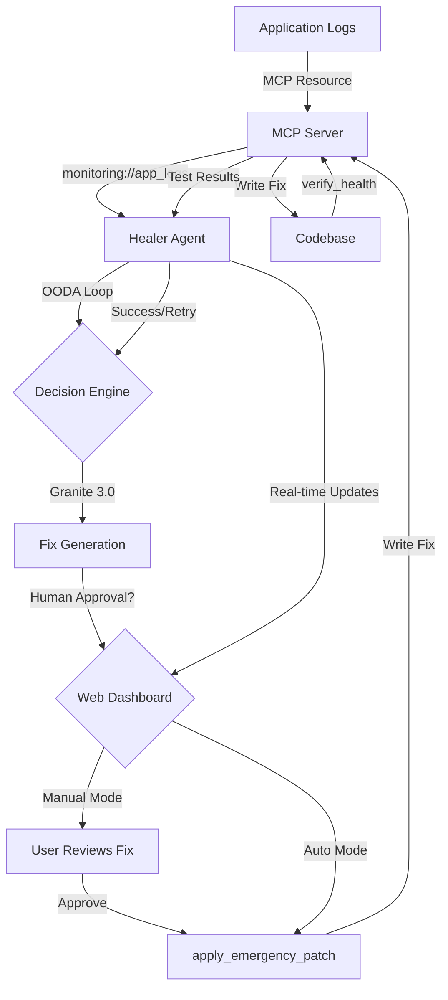

# Updated Implementation Plan - With Web Dashboard

## Changes from Original Plan

### ✅ Added: Web Dashboard with Human-in-the-Loop Approval

Based on user feedback, we've enhanced the system with a **critical safety feature**: a Web Dashboard that provides real-time visualization and **mandatory human approval** for code modifications in Manual Mode.

## New Architecture



## Key Features Added

### 1. Web Dashboard (`/ui` directory)

**Technology Stack**:
- **Backend**: FastAPI (async Python web framework)
- **Frontend**: HTML5 + Tailwind CSS (via CDN)
- **Real-time**: WebSocket for live updates
- **State**: In-memory approval queue

**Dashboard Components**:

1. **OODA Loop Visualizer**
   - Real-time phase tracking (Observe → Orient → Decide → **Approve** → Act)
   - Progress indicators
   - Status animations

2. **Human-in-the-Loop Approval Interface**
   - Side-by-side diff view
   - Risk assessment display
   - LLM reasoning explanation
   - "Confirm Patch" and "Reject" buttons
   - Rejection comment field

3. **Mode Toggle**
   - **Manual Mode** (⚠️): Requires human approval
   - **Auto Mode** (✓): Automatic application
   - Visual indicator and confirmation dialog

4. **System Metrics**
   - Errors detected
   - Fixes applied
   - Success rate
   - Pending approvals
   - System health

5. **Error Log Display**
   - Real-time error stream
   - Severity color coding
   - Expandable stack traces
   - Search and filter

6. **Healing Timeline**
   - Historical log of attempts
   - Success/failure indicators
   - Timing information

### 2. Enhanced OODA Loop

The OODA loop now includes a **5th phase** in Manual Mode:

1. **Observe** - Monitor system state
2. **Orient** - Analyze error context
3. **Decide** - Generate fix with Granite 3.0
4. **Approve** - **NEW: Wait for human approval** (Manual Mode only)
5. **Act** - Apply and verify fix

### 3. API Endpoints

**REST API**:
- `GET /` - Dashboard UI
- `GET /api/status` - System status
- `GET /api/errors` - Error list
- `GET /api/pending-fixes` - Approval queue
- `POST /api/approve/{fix_id}` - Approve fix
- `POST /api/reject/{fix_id}` - Reject fix
- `POST /api/mode` - Toggle mode

**WebSocket**:
- `WS /ws` - Real-time bidirectional communication
- Live OODA phase updates
- Error notifications
- Fix approval requests
- Metrics updates

## Updated Project Structure

```
context-aware-healing-system/
├── README.md
├── IMPLEMENTATION_PLAN.md
├── TECHNICAL_SPEC.md
├── DEPENDENCIES.md
├── WEB_DASHBOARD_SPEC.md          # NEW: Dashboard specification
├── pyproject.toml
├── requirements.txt
├── .env.example
├── .gitignore
│
├── mcp_server/                    # MCP Server Component
│   ├── __init__.py
│   ├── server.py
│   ├── resources.py
│   ├── tools.py
│   ├── config.py
│   └── utils.py
│
├── ui/                            # NEW: Web Dashboard
│   ├── __init__.py
│   ├── main.py                    # FastAPI application
│   ├── websocket.py               # WebSocket handler
│   ├── models.py                  # Pydantic models
│   └── static/                    # Frontend assets
│       ├── index.html             # Dashboard UI
│       └── app.js                 # Frontend JavaScript
│
├── healer_agent.py                # Main healing agent
├── ooda_loop.py                   # OODA loop (with Approve phase)
├── error_detector.py              # Error detection
├── fix_generator.py               # LLM-based fix generation
├── patch_applier.py               # Patch application
├── approval_manager.py            # NEW: Approval queue management
│
├── config/
│   ├── agent_config.yaml
│   ├── mcp_config.yaml
│   └── ui_config.yaml             # NEW: Dashboard config
│
├── examples/
│   ├── broken_app.py
│   ├── test_broken_app.py
│   └── logs/
│
├── tests/
│   ├── test_mcp_server.py
│   ├── test_healer_agent.py
│   ├── test_ooda_loop.py
│   ├── test_ui_api.py             # NEW: Dashboard tests
│   └── test_approval_flow.py      # NEW: Approval workflow tests
│
├── logs/
└── backups/
```

## Updated Dependencies

### New Dependencies Added

```toml
# Web Framework
fastapi = ">=0.110.0"
uvicorn = {extras = ["standard"], version = ">=0.27.0"}

# WebSocket
websockets = ">=12.0"
python-multipart = ">=0.0.9"
```

## Updated Implementation Phases

### Phase 1: Foundation Setup ✅
- [x] Project structure defined
- [x] Dependencies specified
- [x] Configuration schema designed
- [x] Documentation created

### Phase 2: MCP Server Implementation
- [ ] Create MCP server boilerplate
- [ ] Implement `monitoring://app_logs` resource
- [ ] Implement `apply_emergency_patch` tool
- [ ] Implement `verify_health` tool
- [ ] Add error handling and validation

### Phase 3: OODA Loop Core
- [ ] Implement Observer (error detection)
- [ ] Implement Orienter (context analysis)
- [ ] Implement Decider (fix generation)
- [ ] Implement Actor (patch application)
- [ ] Add retry and fallback mechanisms

### Phase 4: Web Dashboard ⭐ NEW
- [ ] Create FastAPI application structure
- [ ] Implement REST API endpoints
- [ ] Build WebSocket handler for real-time updates
- [ ] Create HTML/CSS dashboard with Tailwind
- [ ] Implement JavaScript for live OODA visualization
- [ ] Add human-in-the-loop approval interface
- [ ] Implement manual/auto mode toggle

### Phase 5: Healer Agent Integration
- [ ] Integrate OODA loop with MCP client
- [ ] Connect healer agent to Web Dashboard
- [ ] Implement autonomous decision-making
- [ ] **Add human approval gate for manual mode** ⭐
- [ ] Add safety checks and validation
- [ ] Create monitoring and alerting
- [ ] Implement approval queue management

### Phase 6: Testing & Examples
- [ ] Create broken example application
- [ ] Write comprehensive test suite for all components
- [ ] Add integration tests for dashboard
- [ ] **Test manual approval workflow** ⭐
- [ ] Create documentation and usage examples

### Phase 7: Production Hardening
- [ ] Add rate limiting and throttling
- [ ] Implement circuit breakers
- [ ] Add comprehensive metrics
- [ ] Security audit and hardening
- [ ] Performance optimization
- [ ] Create deployment guides

## Critical Safety Features

### 1. Manual Mode (Default)
- **All fixes require explicit human approval**
- User reviews diff, risk assessment, and LLM reasoning
- Can reject with comments for alternative approaches
- Approval queue prevents accidental auto-application

### 2. Auto Mode (Optional)
- Bypasses human approval
- Only for trusted environments
- Requires explicit mode toggle with confirmation
- Can be switched back to Manual at any time

### 3. Audit Trail
- All approvals/rejections logged
- Complete history of decisions
- Rejection reasons stored
- Timestamps for compliance

### 4. Risk Assessment
- Every fix includes risk level (LOW, MEDIUM, HIGH)
- Risk factors clearly displayed
- High-risk fixes highlighted
- Confidence scores shown

## User Workflow

### Manual Mode (Recommended)

1. **Error Detected**
   - Dashboard shows new error in real-time
   - OODA loop enters "Observe" phase

2. **Analysis**
   - System analyzes error context
   - OODA loop enters "Orient" phase

3. **Fix Generation**
   - Granite 3.0 generates fix
   - OODA loop enters "Decide" phase

4. **Human Review** ⭐
   - Dashboard shows pending fix
   - User clicks "View Details"
   - Reviews diff, risk, and reasoning
   - OODA loop enters "Approve" phase (waiting)

5. **User Decision**
   - **Approve**: Fix is applied and verified
   - **Reject**: System tries alternative approach
   - OODA loop enters "Act" phase (if approved)

6. **Verification**
   - Tests run automatically
   - Results shown in dashboard
   - Success/failure logged in timeline

### Auto Mode (Advanced)

1-3. Same as Manual Mode

4. **Automatic Application**
   - Fix applied immediately after generation
   - No human approval required
   - OODA loop skips "Approve" phase

5-6. Same as Manual Mode

## Estimated Implementation Time

- **Phase 2 (MCP Server)**: 4-6 hours
- **Phase 3 (OODA Loop)**: 6-8 hours
- **Phase 4 (Web Dashboard)**: 8-10 hours ⭐ NEW
- **Phase 5 (Integration)**: 6-8 hours
- **Phase 6 (Testing)**: 6-8 hours
- **Phase 7 (Hardening)**: 4-6 hours

**Total**: 34-46 hours (increased from 22-32 hours)

## Success Criteria

1. ✅ **Planning Complete**: All design documents created
2. ⏳ **MCP Server Functional**: Resources and tools working
3. ⏳ **Error Detection**: Successfully detects errors from logs
4. ⏳ **Fix Generation**: Granite 3.0 generates valid fixes
5. ⏳ **Dashboard Live**: Real-time OODA visualization ⭐
6. ⏳ **Manual Approval**: Human-in-the-loop working ⭐
7. ⏳ **Patch Application**: Safely applies fixes with backups
8. ⏳ **Health Verification**: Tests confirm fixes work
9. ⏳ **Example Healing**: Broken app successfully healed
10. ⏳ **Test Coverage**: >80% code coverage
11. ⏳ **Documentation**: Complete user and developer docs
12. ⏳ **Production Ready**: Deployed and monitored

## Security Enhancements

### Dashboard Security
1. **Authentication**: JWT-based auth (future)
2. **CORS**: Proper WebSocket CORS configuration
3. **Rate Limiting**: API request limits
4. **Input Validation**: All user inputs validated
5. **XSS Protection**: Content sanitization
6. **CSRF Protection**: State-changing operation tokens

### Approval Security
1. **Audit Logging**: All approvals/rejections logged
2. **Session Management**: Secure WebSocket sessions
3. **Timeout**: Pending approvals expire after N minutes
4. **Multi-factor**: Optional MFA for high-risk fixes (future)

## Documentation Created

1. ✅ **IMPLEMENTATION_PLAN.md** - Complete architecture and phases
2. ✅ **DEPENDENCIES.md** - All required packages
3. ✅ **TECHNICAL_SPEC.md** - Technical specifications
4. ✅ **WEB_DASHBOARD_SPEC.md** - Dashboard specification ⭐ NEW
5. ✅ **README.md** - User-facing documentation
6. ✅ **PLANNING_SUMMARY.md** - Original planning summary
7. ✅ **UPDATED_PLAN_SUMMARY.md** - This document ⭐ NEW

## Next Steps

1. ✅ **Review Updated Plan**: Confirm Web Dashboard requirements
2. ⏳ **Get Final Approval**: Ensure all stakeholders agree
3. ⏳ **Switch to Code Mode**: Begin implementation
4. ⏳ **Start with Phase 2**: Implement MCP server
5. ⏳ **Build Dashboard Early**: Phase 4 for early feedback
6. ⏳ **Iterative Development**: Build and test incrementally
7. ⏳ **User Testing**: Test approval workflow with real users

## Questions Addressed

✅ **Q: How do we ensure code isn't modified without approval?**
**A**: Manual Mode (default) requires explicit human approval via Web Dashboard before any code changes.

✅ **Q: Can we visualize the healing process in real-time?**
**A**: Yes, Web Dashboard shows live OODA loop phases, error detection, and fix application.

✅ **Q: What if the generated fix is wrong?**
**A**: User can reject the fix with comments, and the system will try an alternative approach.

✅ **Q: Can we switch between manual and automatic modes?**
**A**: Yes, mode toggle in dashboard with confirmation dialog.

✅ **Q: How do we track what was approved/rejected?**
**A**: Complete audit trail in healing timeline with timestamps and reasons.

## Approval Checklist

- [x] Architecture design approved
- [x] Technology stack approved
- [x] Security approach approved
- [x] Testing strategy approved
- [x] Documentation structure approved
- [x] Implementation phases approved
- [x] **Web Dashboard design approved** ⭐
- [x] **Human-in-the-loop workflow approved** ⭐
- [ ] Ready to proceed to Code mode

---

**Planning Phase Completed**: 2026-04-08
**Updated With**: Web Dashboard & Human-in-the-Loop Approval
**Next Phase**: Implementation (Code Mode)
**Estimated Completion**: 34-46 hours of development