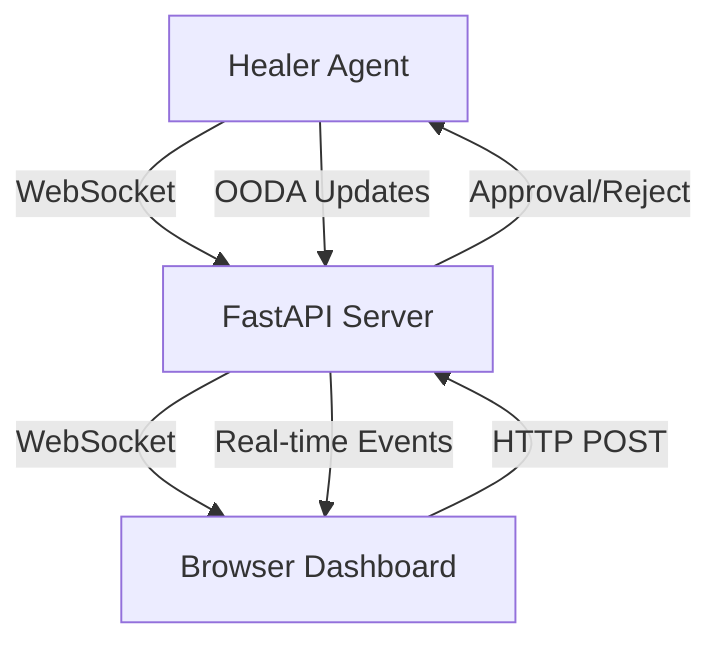

# Web Dashboard Specification

## Overview

The Web Dashboard provides real-time visualization of the OODA loop healing process and implements a critical **Human-in-the-Loop** approval mechanism. This ensures that code modifications require explicit human approval in Manual Mode, providing safety and oversight for autonomous healing operations.

## Architecture



## Technology Stack

- **Backend**: FastAPI 0.110+ (Python async web framework)
- **Frontend**: HTML5 + Tailwind CSS 3.x (via CDN)
- **Real-time**: WebSocket for bidirectional communication
- **State**: In-memory queue for pending approvals
- **Server**: Uvicorn ASGI server

## User Interface Design

### Layout Structure

```
┌─────────────────────────────────────────────────────────────┐
│  Context-Aware Healing System Dashboard                     │
│  [Manual Mode ⚠️] [Auto Mode ✓]                            │
├─────────────────────────────────────────────────────────────┤
│                                                              │
│  ┌──────────────────┐  ┌──────────────────┐                │
│  │ OODA Loop Status │  │ System Metrics   │                │
│  │                  │  │                  │                │
│  │ ● Observe        │  │ Errors: 5        │                │
│  │ ○ Orient         │  │ Fixed: 3         │                │
│  │ ○ Decide         │  │ Success: 60%     │                │
│  │ ○ Approve        │  │ Pending: 2       │                │
│  │ ○ Act            │  │                  │                │
│  └──────────────────┘  └──────────────────┘                │
│                                                              │
│  ┌──────────────────────────────────────────────────────┐  │
│  │ Pending Approvals (Manual Mode)                      │  │
│  │                                                       │  │
│  │ Fix #1: Division by Zero in calculate_average()      │  │
│  │ Risk: LOW | Confidence: 95%                          │  │
│  │ [View Details] [Approve ✓] [Reject ✗]               │  │
│  │                                                       │  │
│  │ Fix #2: TypeError in process_data()                  │  │
│  │ Risk: MEDIUM | Confidence: 85%                       │  │
│  │ [View Details] [Approve ✓] [Reject ✗]               │  │
│  └──────────────────────────────────────────────────────┘  │
│                                                              │
│  ┌──────────────────────────────────────────────────────┐  │
│  │ Recent Errors                                         │  │
│  │                                                       │  │
│  │ [ERROR] 12:34:56 - ZeroDivisionError in app.py:42   │  │
│  │ [ERROR] 12:33:12 - TypeError in utils.py:15         │  │
│  │ [CRITICAL] 12:30:45 - AttributeError in main.py:88  │  │
│  └──────────────────────────────────────────────────────┘  │
│                                                              │
│  ┌──────────────────────────────────────────────────────┐  │
│  │ Healing Timeline                                      │  │
│  │                                                       │  │
│  │ 12:35:00 ✓ Fixed ZeroDivisionError (2.3s)           │  │
│  │ 12:33:30 ✓ Fixed TypeError (1.8s)                   │  │
│  │ 12:31:00 ✗ Failed to fix AttributeError             │  │
│  └──────────────────────────────────────────────────────┘  │
└─────────────────────────────────────────────────────────────┘
```

## Components

### 1. Mode Toggle

**Location**: Top-right header

**States**:
- **Manual Mode** (⚠️ Yellow): Requires human approval for all fixes
- **Auto Mode** (✓ Green): Automatically applies fixes without approval

**Behavior**:
- Click to toggle between modes
- Shows confirmation dialog: "Switch to [Mode]? This will affect how fixes are applied."
- Broadcasts mode change to healer agent via WebSocket

**Implementation**:
```html
<div class="mode-toggle">
  <button id="mode-toggle-btn" class="btn-mode">
    <span id="mode-icon">⚠️</span>
    <span id="mode-text">Manual Mode</span>
  </button>
</div>
```

### 2. OODA Loop Visualizer

**Location**: Top-left panel

**Purpose**: Show current phase of the healing process

**Phases**:
1. **Observe** (🔍) - Monitoring for errors
2. **Orient** (🧭) - Analyzing error context
3. **Decide** (🤔) - Generating fix with LLM
4. **Approve** (👤) - Waiting for human approval (Manual Mode only)
5. **Act** (⚡) - Applying and verifying fix

**Visual States**:
- **Active** (●): Current phase (pulsing animation)
- **Completed** (✓): Phase completed successfully
- **Pending** (○): Phase not yet started
- **Failed** (✗): Phase encountered error

**Real-time Updates**:
- WebSocket message: `{"type": "ooda_phase", "phase": "decide", "status": "active"}`
- Smooth transitions between phases
- Progress bar for long-running phases

### 3. Approval Interface

**Location**: Center panel (only visible in Manual Mode)

**Purpose**: Review and approve/reject proposed fixes

**Fix Card Layout**:
```
┌─────────────────────────────────────────────────────┐
│ Fix #123: ZeroDivisionError in calculate_average() │
│                                                     │
│ File: examples/broken_app.py:42                    │
│ Risk: LOW | Confidence: 95% | Time: 12:34:56      │
│                                                     │
│ [View Diff] [View Context] [View Reasoning]        │
│                                                     │
│ [Approve ✓] [Reject ✗]                            │
└─────────────────────────────────────────────────────┘
```

**Detailed View Modal**:
When "View Diff" is clicked, show modal with:

```
┌─────────────────────────────────────────────────────┐
│ Fix Details: ZeroDivisionError                   [X]│
├─────────────────────────────────────────────────────┤
│                                                     │
│ Error Context:                                      │
│ ┌─────────────────────────────────────────────────┐│
│ │ Traceback (most recent call last):              ││
│ │   File "broken_app.py", line 42, in <module>   ││
│ │     result = calculate_average(numbers)         ││
│ │   File "broken_app.py", line 15, in calculate  ││
│ │     return sum(nums) / len(nums)                ││
│ │ ZeroDivisionError: division by zero             ││
│ └─────────────────────────────────────────────────┘│
│                                                     │
│ Proposed Fix (Diff View):                          │
│ ┌─────────────────────────────────────────────────┐│
│ │ def calculate_average(nums):                    ││
│ │ +   if not nums:                                ││
│ │ +       return 0                                ││
│ │     return sum(nums) / len(nums)                ││
│ └─────────────────────────────────────────────────┘│
│                                                     │
│ LLM Reasoning:                                      │
│ ┌─────────────────────────────────────────────────┐│
│ │ The error occurs when an empty list is passed  ││
│ │ to calculate_average(). Adding a guard clause  ││
│ │ to check if the list is empty prevents the     ││
│ │ division by zero error.                         ││
│ └─────────────────────────────────────────────────┘│
│                                                     │
│ Risk Assessment: LOW                                │
│ - No system calls                                   │
│ - No file operations                                │
│ - Simple logic change                               │
│                                                     │
│ Rejection Reason (optional):                        │
│ ┌─────────────────────────────────────────────────┐│
│ │ [Text area for rejection comments]              ││
│ └─────────────────────────────────────────────────┘│
│                                                     │
│         [Approve ✓]        [Reject ✗]              │
└─────────────────────────────────────────────────────┘
```

**Approval Actions**:

1. **Approve**:
   - POST `/api/approve/{fix_id}`
   - WebSocket message to healer agent
   - Fix card moves to "Applied" section
   - Show success notification

2. **Reject**:
   - POST `/api/reject/{fix_id}`
   - Optional rejection reason
   - WebSocket message to healer agent
   - Fix card moves to "Rejected" section
   - Healer agent tries alternative approach

### 4. System Metrics Panel

**Location**: Top-right panel

**Metrics Displayed**:
- **Total Errors Detected**: Count of errors found
- **Fixes Applied**: Count of successful patches
- **Success Rate**: Percentage of successful fixes
- **Pending Approvals**: Count of fixes awaiting approval
- **Average Healing Time**: Mean time to fix errors
- **System Health**: Overall health indicator (🟢🟡🔴)

**Real-time Updates**:
- WebSocket message: `{"type": "metrics", "data": {...}}`
- Animated counter transitions
- Color-coded indicators

### 5. Error Log Display

**Location**: Middle panel

**Features**:
- Real-time error stream
- Severity color coding:
  - 🔴 CRITICAL
  - 🟠 ERROR
  - 🟡 WARNING
- Expandable stack traces
- Filter by severity
- Search functionality
- Auto-scroll toggle

**Error Entry Format**:
```
[ERROR] 12:34:56 - ZeroDivisionError in broken_app.py:42
  ▶ Stack trace (click to expand)
  Status: Pending Fix
```

### 6. Healing Timeline

**Location**: Bottom panel

**Purpose**: Historical log of healing attempts

**Entry Types**:
- ✓ **Success**: Fix applied and verified
- ✗ **Failed**: Fix failed verification
- ⏸️ **Pending**: Awaiting approval
- 🚫 **Rejected**: User rejected fix

**Entry Format**:
```
12:35:00 ✓ Fixed ZeroDivisionError in broken_app.py (2.3s)
         Applied patch, tests passed
```

## API Endpoints

### REST API

#### GET `/`
**Purpose**: Serve dashboard HTML

**Response**: HTML page with Tailwind CSS

#### GET `/api/status`
**Purpose**: Get current system status

**Response**:
```json
{
  "mode": "manual",
  "ooda_phase": "decide",
  "metrics": {
    "errors_detected": 5,
    "fixes_applied": 3,
    "success_rate": 0.6,
    "pending_approvals": 2,
    "avg_healing_time": 2.5
  },
  "health": "healthy"
}
```

#### GET `/api/errors`
**Purpose**: List detected errors

**Query Parameters**:
- `severity`: Filter by severity (ERROR, CRITICAL)
- `limit`: Max results (default: 50)
- `offset`: Pagination offset

**Response**:
```json
{
  "errors": [
    {
      "id": "err_123",
      "timestamp": "2026-04-08T12:34:56Z",
      "severity": "ERROR",
      "type": "ZeroDivisionError",
      "message": "division by zero",
      "file": "broken_app.py",
      "line": 42,
      "stack_trace": "Traceback...",
      "status": "pending_fix"
    }
  ],
  "total": 5
}
```

#### GET `/api/pending-fixes`
**Purpose**: List fixes awaiting approval

**Response**:
```json
{
  "fixes": [
    {
      "id": "fix_456",
      "error_id": "err_123",
      "timestamp": "2026-04-08T12:35:00Z",
      "file_path": "broken_app.py",
      "original_code": "return sum(nums) / len(nums)",
      "fixed_code": "if not nums:\n    return 0\nreturn sum(nums) / len(nums)",
      "risk_level": "low",
      "confidence": 0.95,
      "reasoning": "Added guard clause to prevent division by zero",
      "status": "pending_approval"
    }
  ],
  "total": 2
}
```

#### POST `/api/approve/{fix_id}`
**Purpose**: Approve a pending fix

**Request Body**:
```json
{
  "comment": "Looks good, approved"
}
```

**Response**:
```json
{
  "success": true,
  "message": "Fix approved and queued for application",
  "fix_id": "fix_456"
}
```

#### POST `/api/reject/{fix_id}`
**Purpose**: Reject a pending fix

**Request Body**:
```json
{
  "reason": "Fix doesn't handle edge case X",
  "request_alternative": true
}
```

**Response**:
```json
{
  "success": true,
  "message": "Fix rejected, requesting alternative approach",
  "fix_id": "fix_456"
}
```

#### POST `/api/mode`
**Purpose**: Toggle between manual and auto mode

**Request Body**:
```json
{
  "mode": "auto"
}
```

**Response**:
```json
{
  "success": true,
  "mode": "auto",
  "message": "Switched to auto mode"
}
```

### WebSocket API

#### WS `/ws`
**Purpose**: Real-time bidirectional communication

**Client → Server Messages**:

1. **Subscribe to updates**:
```json
{
  "type": "subscribe",
  "channels": ["ooda", "errors", "metrics"]
}
```

2. **Ping** (keepalive):
```json
{
  "type": "ping"
}
```

**Server → Client Messages**:

1. **OODA Phase Update**:
```json
{
  "type": "ooda_phase",
  "phase": "decide",
  "status": "active",
  "timestamp": "2026-04-08T12:34:56Z",
  "details": {
    "error_id": "err_123",
    "progress": 0.5
  }
}
```

2. **New Error Detected**:
```json
{
  "type": "error_detected",
  "error": {
    "id": "err_124",
    "severity": "ERROR",
    "type": "TypeError",
    "message": "unsupported operand type",
    "file": "utils.py",
    "line": 15
  }
}
```

3. **Fix Pending Approval**:
```json
{
  "type": "fix_pending",
  "fix": {
    "id": "fix_457",
    "error_id": "err_124",
    "risk_level": "medium",
    "confidence": 0.85
  }
}
```

4. **Fix Applied**:
```json
{
  "type": "fix_applied",
  "fix_id": "fix_456",
  "success": true,
  "verification": {
    "tests_passed": true,
    "duration": 2.3
  }
}
```

5. **Metrics Update**:
```json
{
  "type": "metrics_update",
  "metrics": {
    "errors_detected": 6,
    "fixes_applied": 4,
    "success_rate": 0.67
  }
}
```

6. **Mode Changed**:
```json
{
  "type": "mode_changed",
  "mode": "auto",
  "changed_by": "user"
}
```

## Frontend Implementation

### HTML Structure

```html
<!DOCTYPE html>
<html lang="en">
<head>
    <meta charset="UTF-8">
    <meta name="viewport" content="width=device-width, initial-scale=1.0">
    <title>Context-Aware Healing System</title>
    <script src="https://cdn.tailwindcss.com"></script>
</head>
<body class="bg-gray-900 text-white">
    <div id="app" class="container mx-auto p-4">
        <!-- Header -->
        <header class="flex justify-between items-center mb-6">
            <h1 class="text-3xl font-bold">Context-Aware Healing System</h1>
            <div id="mode-toggle"></div>
        </header>

        <!-- Main Grid -->
        <div class="grid grid-cols-3 gap-4">
            <!-- OODA Loop Status -->
            <div id="ooda-status" class="col-span-1"></div>
            
            <!-- System Metrics -->
            <div id="metrics" class="col-span-2"></div>
        </div>

        <!-- Pending Approvals (Manual Mode Only) -->
        <div id="pending-approvals" class="mt-6"></div>

        <!-- Error Log -->
        <div id="error-log" class="mt-6"></div>

        <!-- Healing Timeline -->
        <div id="timeline" class="mt-6"></div>
    </div>

    <script src="/static/app.js"></script>
</body>
</html>
```

### JavaScript (app.js)

```javascript
class HealingDashboard {
    constructor() {
        this.ws = null;
        this.mode = 'manual';
        this.init();
    }

    init() {
        this.connectWebSocket();
        this.setupEventListeners();
        this.loadInitialData();
    }

    connectWebSocket() {
        this.ws = new WebSocket(`ws://${window.location.host}/ws`);
        
        this.ws.onopen = () => {
            console.log('WebSocket connected');
            this.subscribe(['ooda', 'errors', 'metrics']);
        };

        this.ws.onmessage = (event) => {
            const data = JSON.parse(event.data);
            this.handleWebSocketMessage(data);
        };

        this.ws.onclose = () => {
            console.log('WebSocket disconnected, reconnecting...');
            setTimeout(() => this.connectWebSocket(), 3000);
        };
    }

    subscribe(channels) {
        this.ws.send(JSON.stringify({
            type: 'subscribe',
            channels: channels
        }));
    }

    handleWebSocketMessage(data) {
        switch(data.type) {
            case 'ooda_phase':
                this.updateOODAPhase(data);
                break;
            case 'error_detected':
                this.addError(data.error);
                break;
            case 'fix_pending':
                this.addPendingFix(data.fix);
                break;
            case 'fix_applied':
                this.updateTimeline(data);
                break;
            case 'metrics_update':
                this.updateMetrics(data.metrics);
                break;
            case 'mode_changed':
                this.updateMode(data.mode);
                break;
        }
    }

    async approveFix(fixId) {
        const response = await fetch(`/api/approve/${fixId}`, {
            method: 'POST',
            headers: {'Content-Type': 'application/json'},
            body: JSON.stringify({comment: ''})
        });
        const result = await response.json();
        if (result.success) {
            this.showNotification('Fix approved', 'success');
        }
    }

    async rejectFix(fixId, reason) {
        const response = await fetch(`/api/reject/${fixId}`, {
            method: 'POST',
            headers: {'Content-Type': 'application/json'},
            body: JSON.stringify({reason: reason})
        });
        const result = await response.json();
        if (result.success) {
            this.showNotification('Fix rejected', 'info');
        }
    }

    async toggleMode() {
        const newMode = this.mode === 'manual' ? 'auto' : 'manual';
        const confirmed = confirm(`Switch to ${newMode} mode?`);
        if (!confirmed) return;

        const response = await fetch('/api/mode', {
            method: 'POST',
            headers: {'Content-Type': 'application/json'},
            body: JSON.stringify({mode: newMode})
        });
        const result = await response.json();
        if (result.success) {
            this.mode = newMode;
            this.updateModeUI();
        }
    }

    // Additional methods for UI updates...
}

// Initialize dashboard
const dashboard = new HealingDashboard();
```

## Security Considerations

1. **Authentication**: Add JWT-based authentication for production
2. **CORS**: Configure CORS properly for WebSocket connections
3. **Rate Limiting**: Limit API requests per user/IP
4. **Input Validation**: Validate all user inputs (rejection reasons, etc.)
5. **XSS Protection**: Sanitize all displayed content
6. **CSRF Protection**: Use CSRF tokens for state-changing operations

## Performance Optimization

1. **WebSocket Connection Pooling**: Reuse connections
2. **Message Batching**: Batch multiple updates into single message
3. **Lazy Loading**: Load error details on demand
4. **Pagination**: Paginate error logs and timeline
5. **Caching**: Cache static assets with CDN

## Testing Strategy

1. **Unit Tests**: Test individual API endpoints
2. **Integration Tests**: Test WebSocket message flow
3. **E2E Tests**: Test complete approval workflow
4. **Load Tests**: Test with multiple concurrent users
5. **UI Tests**: Test dashboard responsiveness

## Deployment

### Development
```bash
cd ui
uvicorn main:app --reload --port 8000
```

### Production
```bash
uvicorn ui.main:app --host 0.0.0.0 --port 8000 --workers 4
```

### Docker
```dockerfile
FROM python:3.11-slim
WORKDIR /app
COPY requirements.txt .
RUN pip install -r requirements.txt
COPY . .
CMD ["uvicorn", "ui.main:app", "--host", "0.0.0.0", "--port", "8000"]
```

## Future Enhancements

1. **Multi-user Support**: Multiple users can review fixes
2. **Approval Workflows**: Require N approvals for high-risk fixes
3. **Audit Trail**: Complete history of all approvals/rejections
4. **Notifications**: Email/Slack notifications for pending approvals
5. **Mobile App**: Native mobile app for on-the-go approvals
6. **Analytics Dashboard**: Detailed analytics and trends
7. **A/B Testing**: Test different fix strategies
8. **Learning Mode**: Learn from approved/rejected fixes